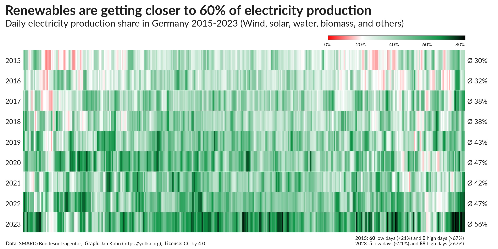
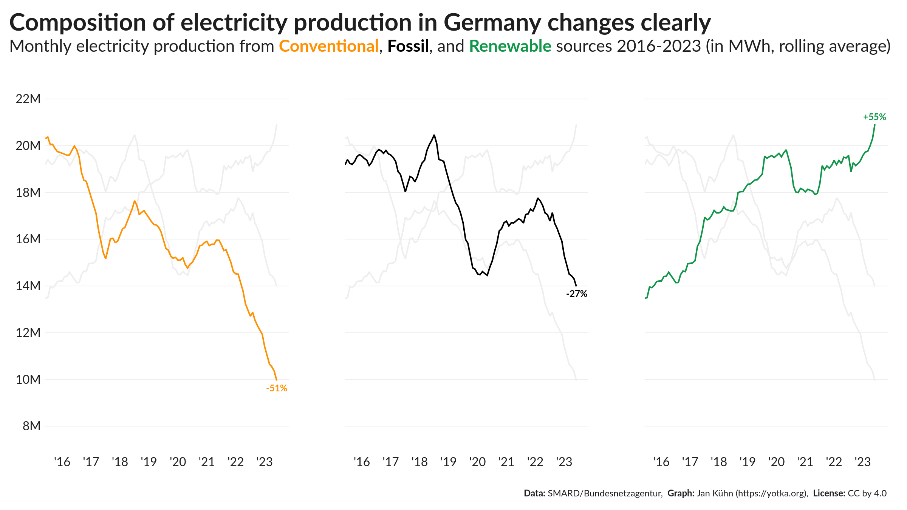
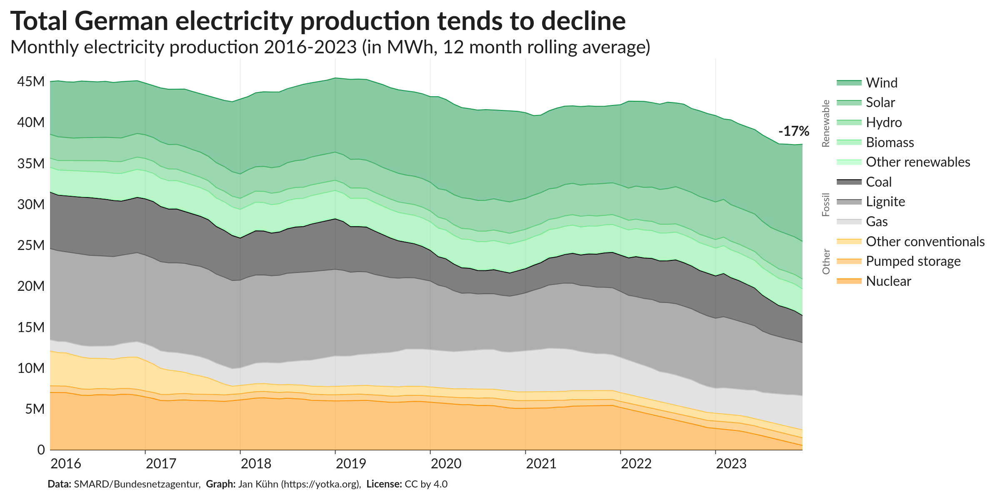

# Day 21: Green Energy

### Contribution to the 2024 [#30DayChartChallenge](https://github.com/30DayChartChallenge/Edition2024): Visualizing Germanys (slow) transformation to renewable electricity.

## What is this about?

For many years, German governments have pledged to leave fossil sources behind to generate electricity. The data shows that there have been some successes. In January 2022, I analyzed the data from the German Federal Network Agency (Bundesnetzagentur) and created a series of plots to visualize the transformation to renewable electricity. Read more about the analysis in an [article published at medium.com](https://yotka.medium.com/visualizing-germanys-slow-transformation-to-renewable-electricity-381289bed264) or see the [repository on GitHub](https://github.com/yotkadata/renewable-electricity).

For the 30DayChartChallenge, I updated the data and created a new set of plots. The data is available in the `data` folder. The plots are in the `export` folder.

## Plots

## Thanks ...

... to [Nassos Stylianou](https://twitter.com/nassos_/status/1611300724184580096) (@nassosstylianou) and [Erwan Rivault](https://twitter.com/ErwanRivault) for the inspiration.
